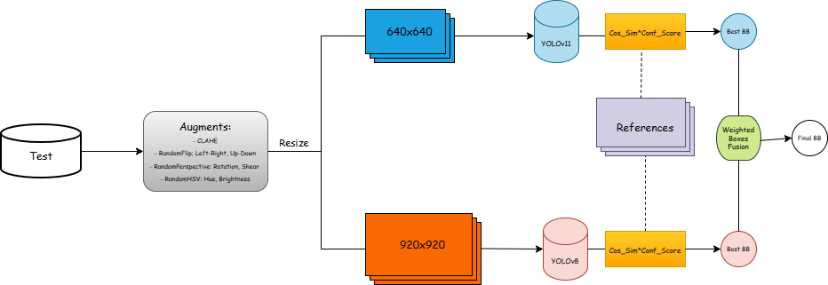
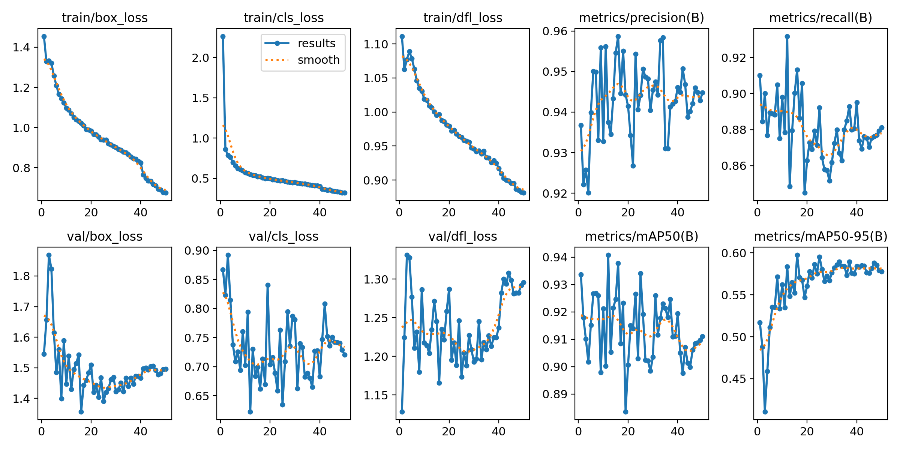
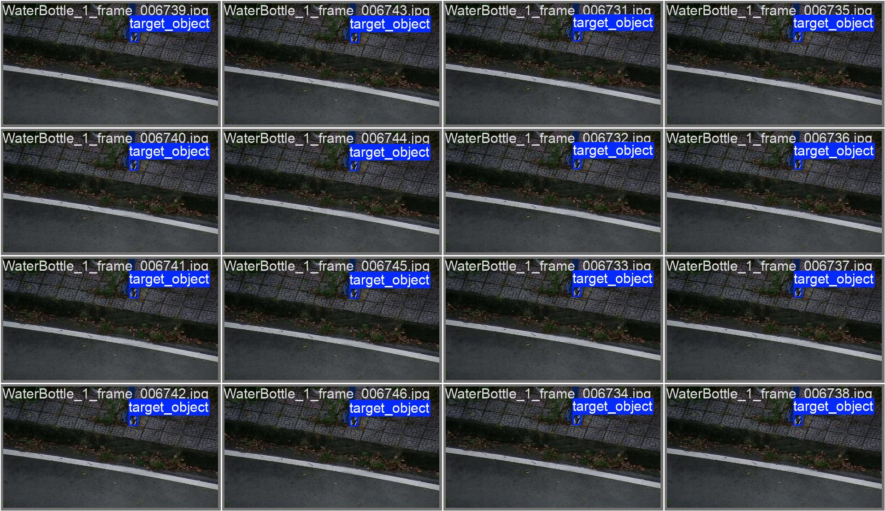
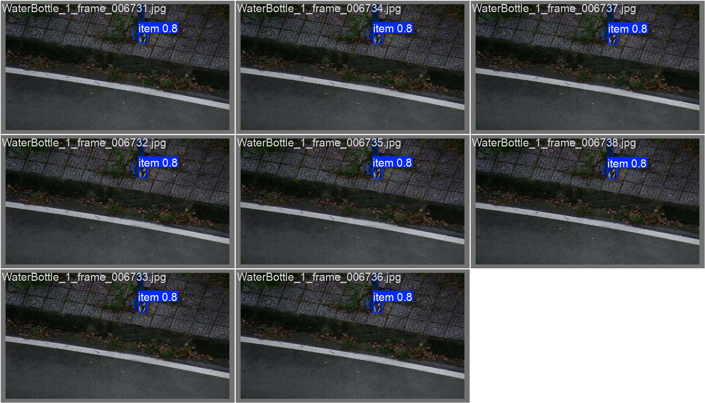

# YOLO Ensembles for Real-Time Small Object Detection on Moving Drones with Reference Images

This repository contains code, configuration, and documentation for the Zalo AI Challenge - AeroEyes (AI-Powered Drone Search & Rescue). It uses an ensemble of YOLO-based detectors with reference-image similarity to improve small object detection performance in moving drones

> Note: The dataset used in the competition is not public. It can be requested from the organizer at: https://challenge.zalo.ai/portal/aero-eyes

## Highlights

- 🏆 Zalo AI Challenge - AeroEyes
- 🚁 Real-time drone search-and-rescue perception
- 📦 YOLOv8-n + YOLOv11-n ensemble
- 🔍 Reference-image similarity verification
- ⚡ Weighted Boxes Fusion + TTA + CLAHE
- 📈 Public leaderboard: Rank 72 / 1600 (49.4% 3D ST-IoU)

## Competition Overview

In emergency and disaster response scenarios, autonomous drones play a crucial role in locating missing persons or critical objects in challenging environments such as flooded zones, forests, or post-storm areas.

This challenge encourages participants to design AI models capable of searching for and localizing a specific object from the drone, based on limited reference images.
 
Mssion: build a perception system that can determine when and where a given target object appears in drone-captured footage — simulating a real-world search-and-rescue mission.

## Pipeline

<p align="center">
<br>
<b>Figure 1.</b> Overall inference pipeline.
</p>

The overall inference pipeline consists of:

1. Input drone frame
2. Optional TTA preprocessing
3. YOLOv8-n and YOLOv11-n inference
4. Reference-image similarity verification and Confidence Reweighting
5. Weighted Boxes Fusion
6. JSON prediction output

## Key Features

- Ensemble of two YOLO models:
  - `YOLOv8-n`
  - `YOLOv11-n`
- Reference image similarity scoring to reweight detection confidence
- Weighted Boxes Fusion for ensemble prediction
- Test-time augmentation (TTA) support during inference
- CLAHE preprocessing option for improved contrast in drone frames
- Prediction output formatted as JSON for challenge submission

### Reasoning

- YOLO Ensembles
  - YOLO is chosen for its strong real-time performance and good small-object detection when tuned correctly (scale, anchors, input resolution, and augmentation).
  - YOLOv8-n and YOLOv11-n exhibit slightly different prediction characteristics due to architectural improvements and training dynamics. Combining their predictions allows one model to recover detections missed by the other, improving robustness without substantially increasing implementation complexity.
  - An ensemble (e.g., multiple YOLO variants or checkpoints) increases robustness across different object scales and lighting conditions. Ensembles combine complementary predictions from different detectors, often improving robustness and recall by reducing model-specific errors.

- Reference image similarity scoring to reweight detection confidence
  - Unlike generic object detection, the target object is accompanied by one or more reference images. This allows the detection pipeline to verify whether a detected region visually matches the expected target rather than relying solely on detector confidence.
  - Bounding boxes vs. identity: Detection confidence indicates the model's belief that an object exists, but does not explicitly verify that the detected appearance matches the provided reference image. For small or visually ambiguous objects, this distinction becomes more important. Using a reference image to verify the appearance inside the bounding box helps decide whether the detection actually contains the object of interest.
  - Cosine similarity specifics:
    - Feature vectors are L2-normalized before comparison, making cosine similarity less sensitive to feature magnitude and more focused on semantic similarity.
    - Simple, fast, and effective: computing cosine similarity between feature vectors (e.g., from a CNN backbone or CLIP-style encoder) is efficient at inference time and can be thresholded easily.
    - When paired with a strong feature extractor (e.g., CLIP or a CNN trained for image retrieval), cosine similarity remains effective under moderate changes in illumination, viewpoint, and scale
  - Implementation pattern:
    1. Extract reference feature vectors for each reference image (once, offline).
    2. For each detection, crop the bounding box, resize and normalize it for the feature extractor, and compute the feature vector.
    3. Compute cosine similarity between the detection vector and reference vectors for each class. The highest similarity score is combined with the detector confidence to produce the final confidence used for filtering and ranking detections
    4. Optionally combine detector class score and cosine similarity (e.g., weighted sum) to make final decision.
  - Rather than replacing detection with classification, similarity verification provides an additional signal that helps distinguish true detections from visually similar false positives.

- Test-time augmentation (TTA) and CLAHE
  - Small objects occupy only a limited number of pixels, making them particularly sensitive to image preprocessing. Transformations such as resizing during TTA or aggressive contrast enhancement can alter fine visual details or amplify noise, potentially degrading detector performance.
    - Despite these concerns, empirical evaluation on the validation set showed that enabling CLAHE and TTA consistently improved detection performance, so both techniques were retained in the final inference pipeline.

## Experimental Results

### Training Performance

| Model | Precision | Recall | mAP@50 | mAP@50:95 |
|------|---------:|-------:|-------:|----------:|
| YOLOv8-n | **95.87%** | **93.18%** | **94.08%** | 59.75% |
| YOLOv11-n | 93.67% | 92.38% | 93.06% | **62.73%** |

YOLOv8-n achieved higher precision and mAP@50, whereas YOLOv11-n obtained the highest mAP@50:95, indicating stronger localization performance under stricter IoU thresholds. Their complementary strengths motivated the use of weighted boxes fusion during inference.

### Leaderboard Performance

| Metric | Result |
|---------|--------|
| Team | AIO_404 |
| Public Rank | 72 / 1600 |
| 3D ST-IoU | 49.4% |

### YOLOv8-n Training & Example Inference

<p align="center">
<br>
<b>Figure 2a.</b> YOLOv8-n Training Performance.
</p>

<p align="center">
<br>
<b>Figure 2b.</b> YOLOv8-n Inference.
</p>

### YOLOv11-n Training & Example Inference

<p align="center">
<br>
<b>Figure 3a.</b> YOLOv11-n Training Performance.
</p>

<p align="center">
<br>
<b>Figure 3b.</b> YOLOv11-n Inference.
</p>


## Repository Structure

- `configs/`
  - `train.yaml` - training experiments for YOLOv8-n and YOLOv11-n
  - `inference.yaml` - inference settings and model paths
  - `dataset.yaml` - dataset preparation settings
- `data/`
  - `train/` - training data samples and annotations
  - `public_test/` - public test data folder structure used for inference
- `scripts/`
  - `train.py` - training entrypoint
  - `submission.py` - inference entrypoint
  - `build_dataset.py` - dataset preparation script
  - `visualize_dataset.py` - dataset visualization utilities
- `src/`
  - `dataset/` - dataset builder and converter utilities
  - `inference/` - inference and prediction pipeline
  - `models/` - model loading, ensemble fusion, similarity scoring
  - `preprocess/` - image preprocessing (CLAHE)
  - `utils/` - config loading helpers
- `weights/`
  - pretrained weights for YOLOv8-n and YOLOv11-n

## Requirements

Install the Python dependencies listed in `requirements.txt`:

```bash
pip install -r requirements.txt
```

Dependencies include:

- `ultralytics`
- `opencv-python`
- `torch`
- `numpy`
- `matplotlib`
- `ensemble-boxes`
- `PyYAML`
- `tqdm`

## Inference

Run inference on test data using the provided configuration:

```bash
python -m scripts.submission --config configs/inference.yaml
```

Available options:

- `--tta` : enable test-time augmentation
- `--clahe` : enable CLAHE preprocessing

Example:

```bash
python -m scripts.submission --config configs/inference.yaml --tta --clahe
```

The script saves predictions to the path defined in `configs/inference.yaml` (`predictions.json` by default).

## Training

Train a YOLO model using the training script and config file:

```bash
python -m scripts.train --config configs/train.yaml --experiment yolo11n
```

Supported arguments:

- `--config` : path to training config file
- `--experiment` : experiment name from `configs/train.yaml` (`yolov8n`, `yolo11n`)
- `--epochs`, `--batch`, `--imgsz`, `--patience`
- `--lr0`, `--optimizer`, `--cos-lr`
- `--device`, `--workers`, `--project`, `--name`

## Dataset Preparation

The project uses a dataset config for generation of YOLO dataset structure from raw data.

To generate or update the dataset, inspect and run `scripts/build_dataset.py`.

## Model Ensemble and Postprocessing

Inference uses two models and fuses their predictions with weighted boxes fusion from `ensemble-boxes`. Reference image similarity scores are computed for each ROI and used to improve confidence weighting.

- `src/models/detector.py` : loads YOLO models and extracts detections
- `src/models/ensemble.py` : performs weighted boxes fusion between model outputs
- `src/models/similarity.py` : computes cosine similarity scores against reference images

## Notes

- Use the `configs/inference.yaml` file to update test directories, reference image locations, and model paths.
- Ensure `YOLO_Weights/YOLOv8-n.pt` and `YOLO_Weights/YOLOv11-n.pt` exist or update `configs/inference.yaml` to your model weights paths.
- The current dataset config references `yolo_dataset/dataset.yaml`, which is expected to be generated by dataset build steps.

## License

This project is released under the license in `LICENSE`.